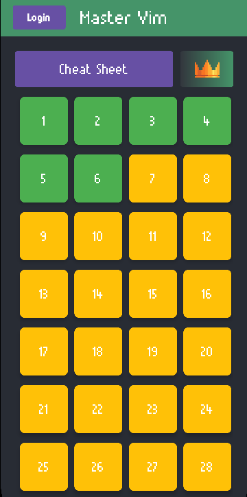
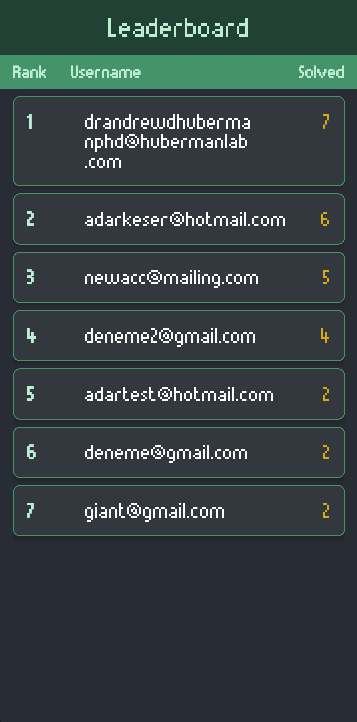

# Vim Teacher

An Android application designed to help users learn Vim commands through an interactive question-based learning system.

## Features

-   Interactive question sets to learn Vim commands
-   Progress tracking with color-coded questions (green for solved, yellow for unsolved)
-   Cheat sheet for quick reference
-   Leaderboard system to track user progress
-   Firebase integration for user authentication and progress tracking
-   Material Design UI with custom styling
-   RecyclerViews with animations

## Technology Stack

-   Kotlin
-   Android SDK
-   Firebase Authentication
-   Cloud Firestore
-   Navigation Component
-   ViewBinding
-   MVVM Architecture
-   RecyclerView with ListAdapter
-   Material Design Components

## Getting Started

1.  Clone the repository
2.  Add your `google-services.json` file to the app directory (For Firebase)
3.  Create a new Firestore Database
4.  Build and run the project using Android Studio

## Project Structure

-   `adapter/` - RecyclerView adapters
-   `model/` - Data models
-   `services/` - Firebase services
-   `viewmodel/` - ViewModels for MVVM architecture
-   `fragments/` - UI fragments

## Screenshots

### Firestore Collections:

-  `users` - Tracks users (email: String, questions_solved:Int)
- `questions` - Tracks questions (provided in the photos below)
- `userQuestions` - Tracks solved questions (questionId: Int, userId: String)

## Contributing

Feel free to submit issues and pull requests.
